# Machine Learning Project Credit Scorecard Model (Using Logistic Regression) on Home Credit Indonesia

## Project Description

**Problem :**  
The main risk for loan companies is failure to assess credit risk accurately and efficiently. Disadvantage of Manual credit risk assessment :

- Subjectivity can introduce bias and inconsistency in decision-making
- Time-consuming especially when dealing with a large number of loan applications.
- Humans errors, such as data entry mistakes, miscalculations, or oversight of important details

**Challenges :**  
Build a machine learning model that can automatically assess loans

## Project Goal

- Predict client’s repayment abilities
- Speed up inspection filing without spending more money

## Tools & Library Used

 &nbsp;
 &nbsp;

## Project Result

[Click here to get full code](https://github.com/nickenshidqia/Credit_Scorecard_Model_Home_Credit_Indonesia/blob/231cfbdf0f00f1c50a5f480c4622abf3797fe353/Home_Credit_Scorecard_Nicken_Shidqia.ipynb)

## Data Preprocessing

### A. Data Cleaning

There are 40 columns that have null values. And handling missing value by drop feature that have missing value > 50%, and replace missing values on numerical category with median & categorical with mode.  
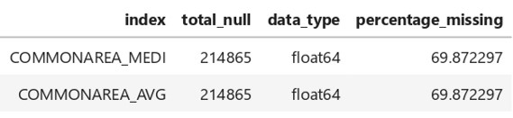

### B. Feature Selection

Split Data Train (80:20).

Categorical & Numerical Selection with criteria :

- Low cardinality (unique)
- No null values
- p-value < 0.05 (using chi square for categorical & ANOVA for numerical)
- Correlation coefficient <= 0.7

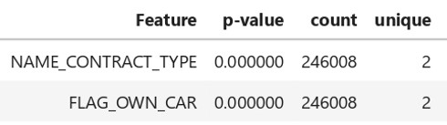

**Before** Feature Selection = 122 columns  
**After** Feature Selection = 16 columns

### C. Feature Engineering

**Weight of Evidence (WOE) & Information Value (IV)**  
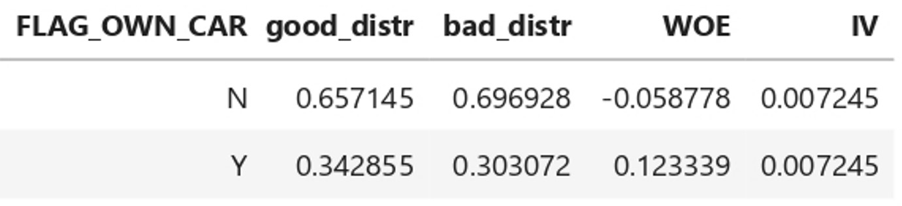

- WOE generally described as a measure of the separation of good and bad customers
- IV helps to rank variables on the basis of their importance.

Drop Feature No Needed :

- IV < 0.02, The variable is Not useful for prediction
- IV> 0.5, The variable is Suspicious Predictive Power

**Before** Feature Engineering = 16 columns  
**After** Feature Engineering = 14 columns

## 2 Top Data Visualization & Insight

### A. Clients Repayment Abilities by Gender

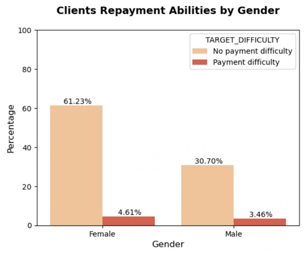  
 
- 61.23% customers that do not have payment difficulty are female, and 30.70% are Male
- In UK, Women account for 65% of the home credit industry's customers (Bermeo, 2018)
- Recommendation : Start a campaign to encourage more women to apply for credit

### B. Clients Repayment Abilities by Occupation Type

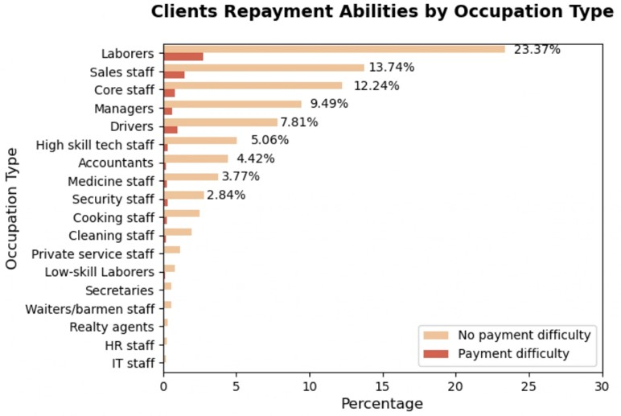  
 
- 23.37% customers that do not have payment difficulty are laborers, then followed by staff and managers.
- Recommendation : Start a campaign to encourage more laborers, staff, and managers to apply for credit

## Machine Learning Implementation

### A. Evaluation Score

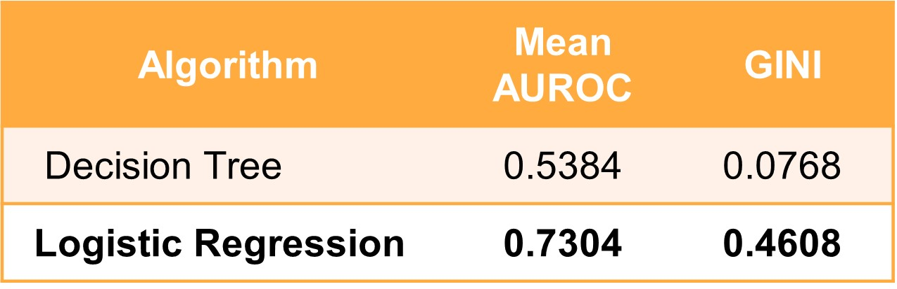  
 
- Mean AUROC of 0.7304 is generally considered good, indicating that the logistic regression model is effective at distinguishing between the positive and negative classes.
- Based on (Trifonova, 2012) An AUC - ROC 0.7–0.8 is considered good.
- Gini coefficient of 0.4608 indicates a relatively strong separation between the model's performance and random chance.
- It suggests that the logistic regression model has a good discriminatory ability.
- Based on (Teng, 2011) Gini coefficient 0.4 - 0.5 considered big gap.

### B. Score Card

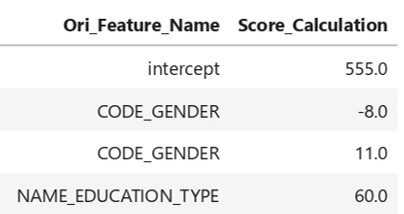  
 
- Base (Intercept) = 555
- Min Score = 300 (FICO)
- Max Score = 850 (FICO)

### C. Confusion Matrix with Threshold = 0.5

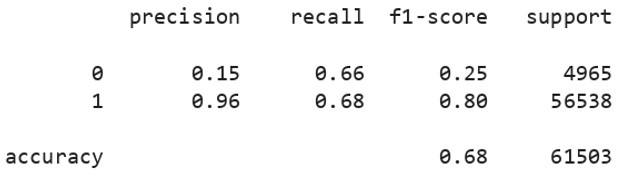  
 
- Precision = Out of all the loan status that the model predicted would get good loan, only 96% actually did.
- Recall = Out of all the loan status that actually did get good loan, the model only predicted this outcome correctly for 68% ofthose loan status.
- F1 Score = 0.8. F1 score of 0.7 or higher is often considered good (spotintelligence.com, 2023)
The accuracy is not really good because we've got 0.68 out of 1

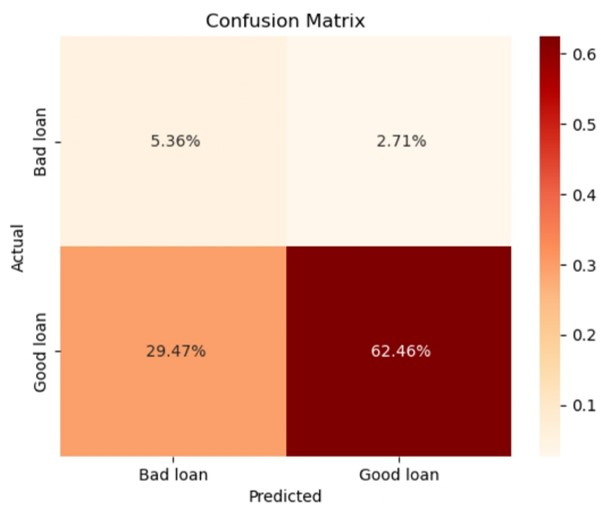
  
62.46% got correct variable of good loan

### D. Confusion Matrix with Best Threshold

- Best threshold = 0.353918 (Using Youden J-Statistic)
- Best threshold is used to minimized the False Positive Rate and maximize the True Positive Rate

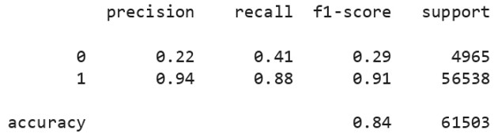  
 
- Precision = Out of all the loan status that the model predicted would get good loan, only 94% actually did.
- Recall = Out of all the loan status that actually did get good loan, the model only predicted this outcome correctly for 88% ofthose loan status.
- F1 Score = 0.9. F1 score of 0.7 or higher is often considered good (spotintelligence.com, 2023)
The accuracy increased significantly from 0.68 to 0.84

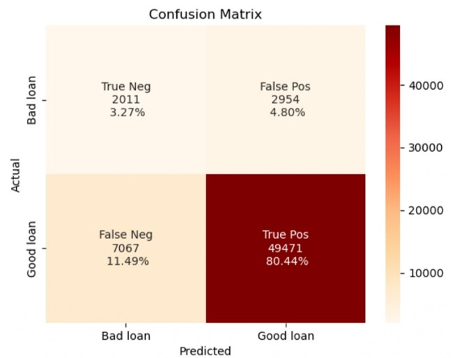 
  
80.44% got correct variable of good loan.

### E. Approval & Rejection Rate

**(Threshold = 0.5)**  
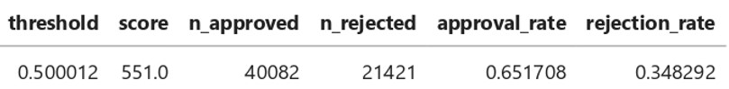

- Choosing a 0.5 threshold might mean rejecting a lot of applicants with rejection rate 34%, which could lead to losing business

**(Best Threshold = 0.353918)**  
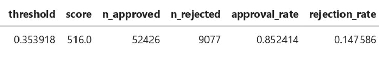

- With best threshold, we've got rejection rate 14%
- So, we've decided to keep our preferred threshold = 0.353918 and Credit Score of 516

## Business Recommendation

**Partial Auto Reject & Auto Approve**

- If a submission seems bad, it is rejected right away.
- If a submission appears to be very good, it is accepted immediately.
- If there's uncertainty, it is manually checked by the assessment team.

**Create targeted campaign**

- We should launch additional campaigns targeting women, laborers, staff, and managers to encourage them to apply for credit.
